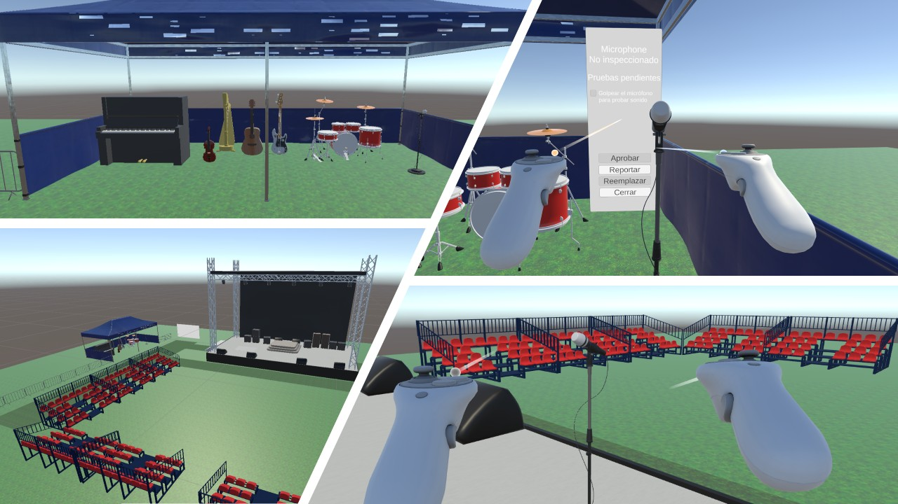

# BackstageVR

El ejecutable para cascos VR es el archivo `BackStageVR.apk`.

Instalación de ejemplo (ADB):

```cmd
adb install BackStageVR.apk
```

Si prefieres la documentación completa del proyecto, consulta `docs/README-full.md` (opcional).
# BackstageVR



BackstageVR es una experiencia de inspección y reemplazo de instrumentos en realidad virtual. El jugador (acomodador) inspecciona instrumentos, ejecuta pruebas visuales y auditivas, reporta daños y realiza reemplazos cuando corresponde. El proyecto usa `XR Interaction Toolkit` y registra la actividad del jugador en JSON mediante `PlayerActivityTracker`.

---

## Tecnologías principales

- Unity Editor (ver `ProjectSettings/ProjectVersion.txt`)
- XR Interaction Toolkit (`com.unity.xr.interaction.toolkit`) y OpenXR
- Input System (`com.unity.inputsystem`)
- Universal Render Pipeline (`com.unity.render-pipelines.universal`)
- Ink (Inkle) para contenido narrativo (`Assets/Ink`)

## Requisitos

- Unity Hub y la versión de Unity indicada en `ProjectSettings/ProjectVersion.txt`.
- Git para clonar el repositorio.
- IDE recomendado: Visual Studio (Windows) o Rider.
- Para builds Android: Android SDK/NDK y OpenJDK.
- Para pruebas VR: un runtime OpenXR compatible (SteamVR, Oculus, etc.) y HMD/controladores configurados.

## Qué incluye

- Inspección de instrumentos con checklist de pruebas (visual y sonora).
- Sistema de manifestación de defectos por prueba (configurable por probabilidad).
- Reemplazo automático por prefabs "buenos" cuando se reporta un instrumento dañado.
- `PlayerActivityTracker`: registro de posiciones, rotaciones, eventos (grab/release/activate), duración de inspecciones por instrumento y duración total de la sesión.

## Clonar y abrir el proyecto (desarrollo)

```bash
git clone <repo-url> BackstageVR
cd BackstageVR
```

1. Abre Unity Hub → `Add` → selecciona la carpeta `BackstageVR`.
2. Abre el proyecto con la versión indicada en `ProjectSettings/ProjectVersion.txt`.
3. Espera a que Unity importe paquetes y assets. Usa Package Manager si faltan dependencias.

## Ejecutable (APK)

El ejecutable para cascos VR es el archivo `BackStageVR.apk`.

Instalación de ejemplo (ADB):

```cmd
adb install BackStageVR.apk
```

O sigue el procedimiento de instalación del fabricante para tu headset.

## Logs y ubicación

- `PlayerActivityTracker` guarda un JSON por sesión en `Application.persistentDataPath`.
- En Windows la ruta típica es: `C:\Users\<Usuario>\AppData\LocalLow\<CompanyName>\<ProductName>\`.
- Nombre de archivo: `player_activity_{sessionId}_{timestamp}.json`.

## Uso rápido (Editor)

1. Abre la escena principal (por ejemplo `Assets/Scenes/BackstageVR.unity`).
2. Asegura que `PlayerActivityTracker` esté presente en el `XR Rig` o en la escena.
3. Ejecuta la escena, realiza interacciones y detén la simulación para guardar el log.

## Estructura relevante

- `Assets/`: assets y scripts de Unity.
- `Assets/Scripts/InspectableInstrument.cs`: lógica de instrumentación e inspección.
- `Assets/Scripts/InstrumentDefs.cs`: definición de checks y tests.
- `Assets/Scripts/PlayerActivityTracker.cs`: tracker y exportador JSON.
- `Packages/manifest.json`: lista de paquetes del proyecto.

## Contribuir

- Haz un fork, crea una rama con cambios descriptivos y abre un Pull Request.
- Añade tests cuando modifiques lógica crítica (Test Framework incluido).

## Contacto

Abre un Issue en el repositorio para reportar errores o preguntar dudas.
# BackstageVR


BackstageVR es una experiencia de inspección y reemplazo de instrumentos en realidad virtual. El jugador (acomodador) inspecciona instrumentos, ejecuta pruebas visuales y auditivas, reporta daños y realiza reemplazos cuando corresponde. El proyecto usa `XR Interaction Toolkit` y registra la actividad del jugador en JSON mediante `PlayerActivityTracker`.

---

## Tecnologías principales

- Unity Editor (ver `ProjectSettings/ProjectVersion.txt`)
- XR Interaction Toolkit (`com.unity.xr.interaction.toolkit`) y OpenXR
- Input System (`com.unity.inputsystem`)
- Universal Render Pipeline (`com.unity.render-pipelines.universal`)
- Ink (Inkle) para contenido narrativo (`Assets/Ink`)

## Requisitos

- Unity Hub y la versión de Unity indicada en `ProjectSettings/ProjectVersion.txt`.
- Git para clonar el repositorio.
- IDE recomendado: Visual Studio (Windows) o Rider.
- Para builds Android: Android SDK/NDK y OpenJDK.
- Para pruebas VR: un runtime OpenXR compatible (SteamVR, Oculus, etc.) y HMD/controladores configurados.

## Qué incluye

- Inspección de instrumentos con checklist de pruebas (visual y sonora).
- Sistema de manifestación de defectos por prueba (configurable por probabilidad).
- Reemplazo automático por prefabs "buenos" cuando se reporta un instrumento dañado.
- `PlayerActivityTracker`: registro de posiciones, rotaciones, eventos (grab/release/activate), duración de inspecciones por instrumento y duración total de la sesión.

## Clonar y abrir el proyecto (desarrollo)

```bash
git clone <repo-url> BackstageVR
cd BackstageVR
```

1. Abre Unity Hub → `Add` → selecciona la carpeta `BackstageVR`.
2. Abre el proyecto con la versión indicada en `ProjectSettings/ProjectVersion.txt`.
3. Espera a que Unity importe paquetes y assets. Usa Package Manager si faltan dependencias.

## Ejecutable (APK)

1. El ejecutable para cascos VR es el archivo `BackStageVR.apk`.
2. Instala el APK en el headset (se recomienda usar SideQuest para instalarlo en los meta quests y ser desarrollador)

## Logs y ubicación

- `PlayerActivityTracker` guarda un JSON por sesión en `Application.persistentDataPath`.
- En Windows la ruta típica es: `C:\Users\<Usuario>\AppData\LocalLow\<CompanyName>\<ProductName>\`.
- Nombre de archivo: `player_activity_{sessionId}_{timestamp}.json`.

## Uso rápido (Editor)

1. Abre la escena principal (por ejemplo `Assets/Scenes/BackstageVR.unity`).
2. Asegura que `PlayerActivityTracker` esté presente en el `XR Rig` o en la escena.
3. Ejecuta la escena, realiza interacciones y detén la simulación para guardar el log.

## Estructura relevante

- `Assets/`: assets y scripts de Unity.
- `Assets/Scripts/InspectableInstrument.cs`: lógica de instrumentación e inspección.
- `Assets/Scripts/InstrumentDefs.cs`: definición de checks y tests.
- `Assets/Scripts/PlayerActivityTracker.cs`: tracker y exportador JSON.
- `Packages/manifest.json`: lista de paquetes del proyecto.

## Contribuir

- Haz un fork, crea una rama con cambios descriptivos y abre un Pull Request.
- Añade tests cuando modifiques lógica crítica (Test Framework incluido).

## Contacto

Abre un Issue en el repositorio para reportar errores o preguntar dudas.
# BackstageVR


BackstageVR es una experiencia de inspección y reemplazo de instrumentos en realidad virtual. El jugador (acomodador) inspecciona instrumentos, ejecuta pruebas visuales y auditivas, reporta daños y realiza reemplazos cuando corresponde. El proyecto usa `XR Interaction Toolkit` y registra la actividad del jugador en JSON mediante `PlayerActivityTracker`.

---

## Tecnologías principales

- Unity Editor (ver `ProjectSettings/ProjectVersion.txt`)
- XR Interaction Toolkit (`com.unity.xr.interaction.toolkit`) y OpenXR
- Input System (`com.unity.inputsystem`)
- Universal Render Pipeline (`com.unity.render-pipelines.universal`)
- Ink (Inkle) para contenido narrativo (`Assets/Ink`)

## Requisitos

- Unity Hub y la versión de Unity indicada en `ProjectSettings/ProjectVersion.txt`.
- Git para clonar el repositorio.
- IDE recomendado: Visual Studio (Windows) o Rider.
- Para builds Android: Android SDK/NDK y OpenJDK.
- Para pruebas VR: un runtime OpenXR compatible (SteamVR, Oculus, etc.) y HMD/controladores configurados.

## Qué incluye

- Inspección de instrumentos con checklist de pruebas (visual y sonora).
- Sistema de manifestación de defectos por prueba (configurable por probabilidad).
- Reemplazo automático por prefabs "buenos" cuando se reporta un instrumento dañado.
- `PlayerActivityTracker`: registro de posiciones, rotaciones, eventos (grab/release/activate), duración de inspecciones por instrumento y duración total de la sesión.

## Clonar y abrir el proyecto (desarrollo)

```bash
git clone <repo-url> BackstageVR
cd BackstageVR
```

1. Abre Unity Hub → `Add` → selecciona la carpeta `BackstageVR`.
2. Abre el proyecto con la versión indicada en `ProjectSettings/ProjectVersion.txt`.
3. Espera a que Unity importe paquetes y assets. Usa Package Manager si faltan dependencias.

## Ejecutable (APK)

1.

## Logs y ubicación

- `PlayerActivityTracker` guarda un JSON por sesión en `Application.persistentDataPath`.
- En Windows la ruta típica es: `C:\Users\<Usuario>\AppData\LocalLow\<CompanyName>\<ProductName>\`.
- Nombre de archivo: `player_activity_{sessionId}_{timestamp}.json`.

## Uso rápido (Editor)

1. Abre la escena principal (por ejemplo `Assets/Scenes/BackstageVR.unity`).
2. Asegura que `PlayerActivityTracker` esté presente en el `XR Rig` o en la escena.
3. Ejecuta la escena, realiza interacciones y detén la simulación para guardar el log.

## Estructura relevante

- `Assets/`: assets y scripts de Unity.
- `Assets/Scripts/InspectableInstrument.cs`: lógica de instrumentación e inspección.
- `Assets/Scripts/InstrumentDefs.cs`: definición de checks y tests.
- `Assets/Scripts/PlayerActivityTracker.cs`: tracker y exportador JSON.
- `Packages/manifest.json`: lista de paquetes del proyecto.

## Contribuir

- Haz un fork, crea una rama con cambios descriptivos y abre un Pull Request.
- Añade tests cuando modifiques lógica crítica (Test Framework incluido).

## Contacto

Abre un Issue en el repositorio para reportar errores o preguntar dudas.
